# File Maintenance Tool

A **safe, scheduled file maintenance utility** for Windows that:

- Scans configured folders
- Identifies files older than a given number of days
- Optionally backs them up to a local or network location
- Deletes the original files
- Cleans up empty directories
- Manages log retention
- Runs with **bounded resource usage** (safe for busy PCs and SMB
    shares)

Designed for **unattended execution** (Windows Task Scheduler) and
**network environments**.


---

### 🛠 How It Works

The `file-maintenance` tool performs automated cleanup and optional backups of old files based on configurable rules.

The process follows a predictable and safe execution flow:

1. **Startup & Configuration**
   - CLI flags are parsed
   - Configuration files are loaded
   - Logging is initialized
   - Critical paths are validated

2. **Safety Checks**
   - Ensures target folders exist
   - Verifies backup destination is accessible
   - Terminates early on fatal misconfiguration

3. **Maintenance Worker**
   - Initializes execution context, queues, and counters
   - Captures a run-specific backup date (DDMmmYY)
   - Starts:
     - Bounded folder walkers (discovery only)
     - A single processor goroutine (file operations)

4. **Backup & Cleanup**
   - Eligible files are enqueued for processing
   - Backup destination path is built as:

    ```text
    backupRoot/DDMmmYY/relative-path
    ```
    - Files are copied using streaming I/O with retry + backoff 
    - Original files are deleted only after successful backup
    - Empty directories are cleaned bottom-up

1. **Logging & Exit**
   - All actions are logged (success, warning, error)
   - Logs are flushed before clean exit

---

<!--  -->


> The execution flow reflects a **single-processor design** for file operations:
> folder scanning may be concurrent, but backup and deletion always occur one file at a time.
> Backups are grouped under a per-run date folder (`DDMmmYY`).

## 🚩 Command-Line Flags

### Retention & Deletion

| Flag | Default | Description |
|------|---------|-------------|
| `-days` | `7` | Only files older than this many days are eligible for deletion |
| `-no-backup` | `false` | Delete files without backup |
| `-log-retention` | `30` | Log retention in days |

### Paths & Configuration

| Flag | Default | Description |
|------|---------|-------------|
| `-config-dir` | `<exe>/configs` | Config directory |
| `-log-dir` | `<exe>/logs` | Log directory |
| `-no-logs` | `false` | Console-only logging |

### Resource Controls

| Flag | Default | Description |
|------|---------|-------------|
| `-walkers` | `1` | Concurrent folder walkers |
| `-queue-size` | `300` | Job queue size |
| `-max-files` | `0` | Max files per run (0 = unlimited)|
| `-max-runtime` | `30m` | Max runtime |
| `-cooldown` | `0` | Cooldown between files |
| `-retries` | `2` | Copy retries |

------------------------------------------------------------------------

## ✨ Key Features

- ✅ **Backup before delete** (default, strongly recommended)
- 🗂 **Date-based backups**
  - One folder per run (`DDMmmYY`)
  - Preserves full relative directory structure
- 🧠 **Path-safe backups** 
  - prevents directory traversal
  - Rejects paths escaping the source root
- 🧵 **Bounded concurrency**
  - Parallel folder scanning (configurable)
  - Serialized file operations (copy/delete one file at a time)
- 🌐 **Network-friendly**
  - Streaming file copy (low RAM)
  - Retry + backoff for SMB hiccups
  - Optional cooldown between file operations
- 🧹 **Automatic cleanup**
  - Deletes empty directories (bottom-up, safe boundary)
  - Log retention management
- 🪵 **Configurable logging**
  - File logging or console-only (`-no-logs`)
  - Per-level enable/disable via `logging.json`

------------------------------------------------------------------------

## 📁 Project Structure

    .
    ├── cmd/
    │   └── main/              # CLI entry point
    ├── internal/
    │   ├── app/               # High-level application orchestration
    │   ├── config/            # Reading folders.txt, backup.txt, logging.json
    │   ├── logging/           # Thread-safe logger
    │   ├── maintenance/       # Core logic (scan, backup, delete, cleanup)
    │   ├── types/             # AppConfig definition
    │   └── utils/             # Helpers (exe path resolution, etc.)
    ├── configs/
    │   ├── folders.txt
    │   ├── backup.txt
    │   └── logging.json
    └── build.ps1             # Helpers (Build, run, smoke, coverage helpers)

------------------------------------------------------------------------

## ⚙️ Configuration Files 
These Files are required for the program to run

### `configs/folders.txt`

List of folders **or individual files** to process (one per line).

#### Path Types Supported

| Type | Description | Example |
|------|-------------|---------|
| **Folder** | All files inside the folder (recursively) are evaluated | `C:\Temp\OldFiles` |
| **File** | The specific file is evaluated directly | `C:\Data\Images\old-photo.jpg` |

#### Examples

```text
# Folders - delete all old files from these locations
C:\Temp\OldFiles
    ```text
    # Local temp files
    C:\Temp\OldFiles

    # Network location
\\server\share\incoming
```

# Specific files - delete only these exact files
C:\Data\Images\old-photo.jpg
C:\Logs\debug.log
```

- Empty lines are ignored
- Lines starting with `#` are treated as comments
- Individual files must meet the age criteria (unless `-days 0` is used)

### `configs/backup.txt`

Backup destination root.

```text
    \\server\share\backups
```
- If empty, defaults to ../backups relative to configs/
- Path is validated and write-tested before any deletion occurs

### `configs/logging.json`

Enable/disable log levels.
```json
    {
        "DEBUG": false,
        "COUNT": true,
        "INFO": true,
        "WARN": true,
        "ERROR": true,
        "SUCCESS": true,
        "FATAL": true
    }
```
- `COUNT` is used for summary metrics (ex: deleted files per folder)
- Unknown levels default to enabled (fail-open policy)

------------------------------------------------------------------------

## 📦 Backup Layout (Important)

Backups are written using a date-based folder structure that preserves the original directory hierarchy.

Destination format:

```text
    <backupRoot>/<DDMmmYY>/<relative folder structure>/<filename>
```

Example:
```text
Source file:
C:\Data\Images\2024\Camera\IMG001.jpg

Backup destination:
\\server\share\backups\30Jan26\2024\Camera\IMG001.jpg
```

Why this design:
    - Keeps backups grouped per run/day
    - Preserves original folder structure for easy restore
    - Prevents filename collisions
    - Makes auditing and cleanup straightforward
    - The backup date folder is determined per run.
All files processed in the same run share the same DDMmmYY folder.

## 🚀 Usage

### Basic run
```powershell
    fileMaintenance.exe -days 7
```
Deletes files older than 7 days (after backing them up).

### Disable backups (⚠️ dangerous)
```powershell
    fileMaintenance.exe -days 7 -no-backup
```
Deletes files without backup. Use only intentionally.

### Resource-controlled run (recommended)
```powershell
    fileMaintenance.exe -days 7 -walkers 1 -queue-size 300 -max-files 2500 -max-runtime 30m -cooldown 50ms -retries 2
```
Ideal for:
  - busy workstations
  - large image sets
  - network (SMB) destinations

### Console-only logging
```powershell
    fileMaintenance.exe -days 0 -no-logs
```
------------------------------------------------------------------------

## 🧠 Concurrency Model (Important)

- Folder scanning
Parallel, bounded by `-walkers` (default: 1)
- File operations (copy + delete)
**always serialized** (one file at a time)

Why:
    - Prevents SMB saturation
    - Keeps CPU + disk usage predictable
    - Safer for large files (images, media)

------------------------------------------------------------------------

## 🧹 Empty Directory Cleanup

After a file is deleted:
  - Parent directories are removed **only if empty**
  - Cleanup proceeds bottom-up
  - Deletion never crosses the configured folder root
  - Path comparisons are Windows-safe (case-insensitive)

This keeps folder trees tidy without risk

------------------------------------------------------------------------

## 🗃️ Logging

### File mode (default)

- logs/maintenance_YYYY-MM-DD.log - all levels
- logs/errors_YYYY-MM-DD.log - ERROR only
- logs/count_YYYY-MM-DD.log - COUNT only — (summary totals)

> [NOTE]
> Per-folder delete counts are logged after the run finishes, so totals remain accurate.

### Console mode

- Enabled with `-no-logs`
- Useful for development and smoke tests

Log retention
```text
    log-retention 30
```
Deletes log files older than N days (best-effort, non-fatal).

------------------------------------------------------------------------

## 🕒 Windows Task Scheduler (Recommended Setup)

### Suggested schedule

- Twice daily (e.g., 6:30 AM / 6:30 PM)

Example launch command:
```powershell
    powershell.exe -NoProfile -ExecutionPolicy Bypass -Command ^
    Start-Process -FilePath "C:\path\fileMaintenance.exe" `
    -ArgumentList "-days 7 -walkers 1 -max-runtime 30m -cooldown 50ms" `
    -Priority BelowNormal -WindowStyle Hidden -Wait
```
Task options:
  - ✅ Run whether user is logged on or not
  - ✅ Run as soon as possible after a missed start
  - ✅ Stop task if running longer than 1 hour

------------------------------------------------------------------------

## 🔐 Safety Guarantees

This tool is designed to fail safe:
  - ❌ No deletion if backup root is inaccessible 
  - ❌ No deletion if backup copy fails
  - ❌ No path traversal outside backup root
  - ❌ No directory deletion above configured folder root
  - ❌ No unbounded goroutines or memory growth
  - ✅ Network hiccups handled with retries + backoff

------------------------------------------------------------------------

## 🧪 Development & Testing

### Smoke test
```powershell
    .\build.ps1 smoke
```
- Builds the binary
- Runs with `-no-logs`
- Verifies configs exist

------------------------------------------------------------------------

## 📜 License

Internal / private use.
