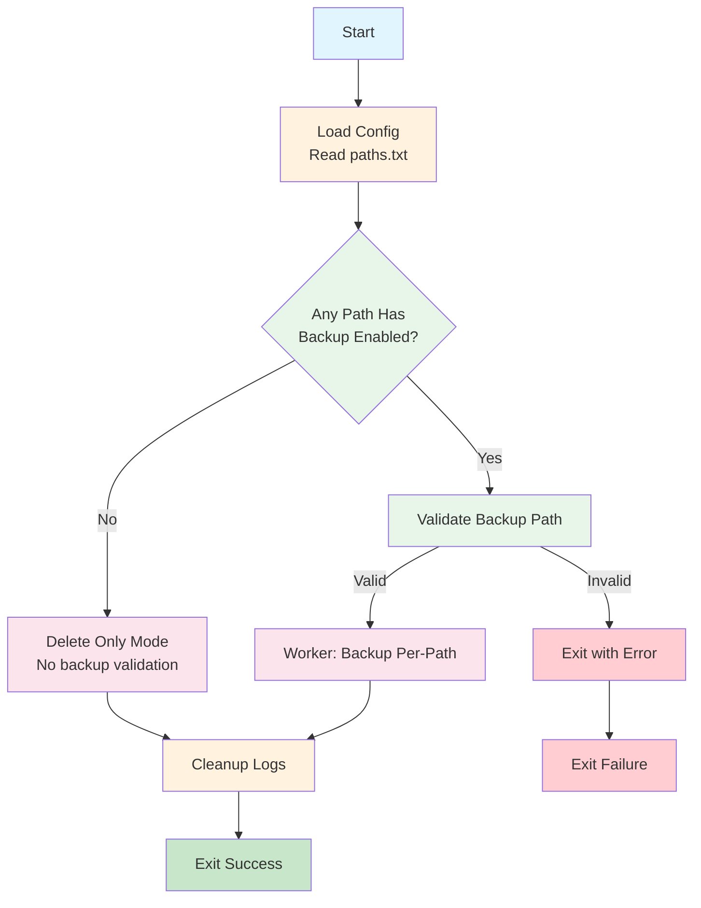

```mermaid
flowchart TD
    A[Start] --> B[Load Config<br/>Read paths.txt]
    B --> C{Any Path Has<br/>Backup Enabled?}
    C -->|No| D[Delete Only Mode<br/>No backup validation]
    C -->|Yes| E[Validate Backup Path]
    E -->|Valid| F[Worker: Backup Per-Path]
    E -->|Invalid| G[Exit with Error]
    
    D --> H[Cleanup Logs]
    F --> H
    
    H --> I[Exit Success]
    G --> J[Exit Failure]

    %% Styling
    style A fill:#e1f5fe
    style B fill:#fff3e0
    style C fill:#e8f5e9
    style D fill:#fce4ec
    style E fill:#e8f5e9
    style F fill:#fce4ec
    style G fill:#ffcdd2
    style H fill:#fff3e0
    style I fill:#c8e6c9
    style J fill:#ffcdd2

```
