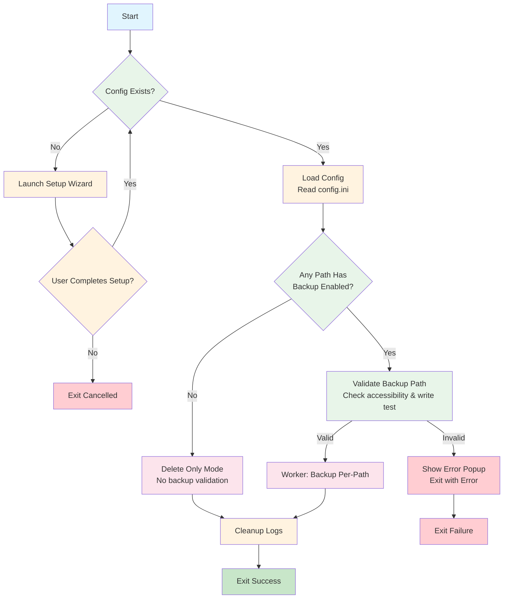

```mermaid
flowchart TD
    A[Start] --> B{Config Exists?}
    B -->|No| C[Launch Setup Wizard]
    C --> D{User Completes Setup?}
    D -->|No| E[Exit Cancelled]
    D -->|Yes| B
    
    B -->|Yes| F[Load Config<br/>Read config.ini]
    F --> G{Any Path Has<br/>Backup Enabled?}
    G -->|No| H[Delete Only Mode<br/>No backup validation]
    G -->|Yes| I[Validate Backup Path<br/>Check accessibility & write test]
    I -->|Valid| J[Worker: Backup Per-Path]
    I -->|Invalid| K[Show Error Popup<br/>Exit with Error]
    
    H --> L[Cleanup Logs]
    J --> L
    L --> M[Exit Success]
    K --> N[Exit Failure]

    %% Styling
    style A fill:#e1f5fe
    style B fill:#e8f5e9
    style C fill:#fff3e0
    style D fill:#fff3e0
    style E fill:#ffcdd2
    style F fill:#fff3e0
    style G fill:#e8f5e9
    style H fill:#fce4ec
    style I fill:#e8f5e9
    style J fill:#fce4ec
    style K fill:#ffcdd2
    style L fill:#fff3e0
    style M fill:#c8e6c9
    style N fill:#ffcdd2

```
