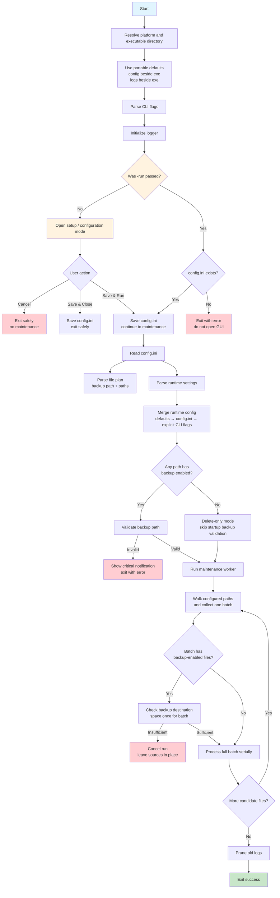

```mermaid
flowchart TD
    A[Start] --> B[Resolve platform and executable directory]
    B --> C[Use portable defaults<br/>config beside exe<br/>logs beside exe]
    C --> D[Parse CLI flags]
    D --> E[Initialize logger]
    E --> F{Was -run passed?}

    F -->|No| G[Open setup / configuration mode]
    G --> H{User action}
    H -->|Cancel| I[Exit safely<br/>no maintenance]
    H -->|Save & Close| J[Save config.ini<br/>exit safely]
    H -->|Save & Run| K[Save config.ini<br/>continue to maintenance]

    F -->|Yes| L{config.ini exists?}
    L -->|No| M[Exit with error<br/>do not open GUI]
    L -->|Yes| K

    K --> N[Read config.ini]
    N --> O[Parse file plan<br/>backup path + paths]
    N --> P[Parse runtime settings]
    P --> Q[Merge runtime config<br/>defaults → config.ini → explicit CLI flags]
    Q --> R{Any path has<br/>backup enabled?}
    R -->|No| S[Delete-only mode<br/>skip startup backup validation]
    R -->|Yes| T[Validate backup path]
    T -->|Invalid| U[Show critical notification<br/>exit with error]
    T -->|Valid| V[Run maintenance worker]
    S --> V
    V --> W[Walk configured paths<br/>and collect one batch]
    W --> X{Batch has<br/>backup-enabled files?}
    X -->|Yes| Y[Check backup destination<br/>space once for batch]
    Y -->|Insufficient| Z[Cancel run<br/>leave sources in place]
    Y -->|Sufficient| AA[Process full batch serially]
    X -->|No| AA
    AA --> AB{More candidate files?}
    AB -->|Yes| W
    AB -->|No| AC[Prune old logs]
    AC --> AD[Exit success]

    style A fill:#e1f5fe
    style F fill:#fff3e0
    style G fill:#fff3e0
    style I fill:#ffcdd2
    style M fill:#ffcdd2
    style U fill:#ffcdd2
    style Z fill:#ffcdd2
    style AD fill:#c8e6c9
```
