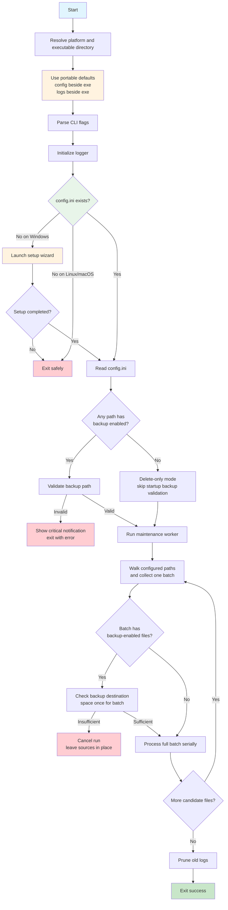

```mermaid
flowchart TD
    A[Start] --> B[Resolve platform and executable directory]
    B --> C[Use portable defaults<br/>config beside exe<br/>logs beside exe]
    C --> D[Parse CLI flags]
    D --> E[Initialize logger]
    E --> F{config.ini exists?}
    F -->|No on Windows| G[Launch setup wizard]
    G --> H{Setup completed?}
    H -->|No| I[Exit safely]
    H -->|Yes| J[Read config.ini]
    F -->|No on Linux/macOS| I
    F -->|Yes| J
    J --> K{Any path has<br/>backup enabled?}
    K -->|No| L[Delete-only mode<br/>skip startup backup validation]
    K -->|Yes| M[Validate backup path]
    M -->|Invalid| N[Show critical notification<br/>exit with error]
    M -->|Valid| O[Run maintenance worker]
    L --> O
    O --> P[Walk configured paths<br/>and collect one batch]
    P --> Q{Batch has<br/>backup-enabled files?}
    Q -->|Yes| R[Check backup destination<br/>space once for batch]
    R -->|Insufficient| S[Cancel run<br/>leave sources in place]
    R -->|Sufficient| T[Process full batch serially]
    Q -->|No| T
    T --> U{More candidate files?}
    U -->|Yes| P
    U -->|No| V[Prune old logs]
    V --> W[Exit success]

    style A fill:#e1f5fe
    style C fill:#fff3e0
    style F fill:#e8f5e9
    style G fill:#fff3e0
    style I fill:#ffcdd2
    style N fill:#ffcdd2
    style S fill:#ffcdd2
    style W fill:#c8e6c9
```
