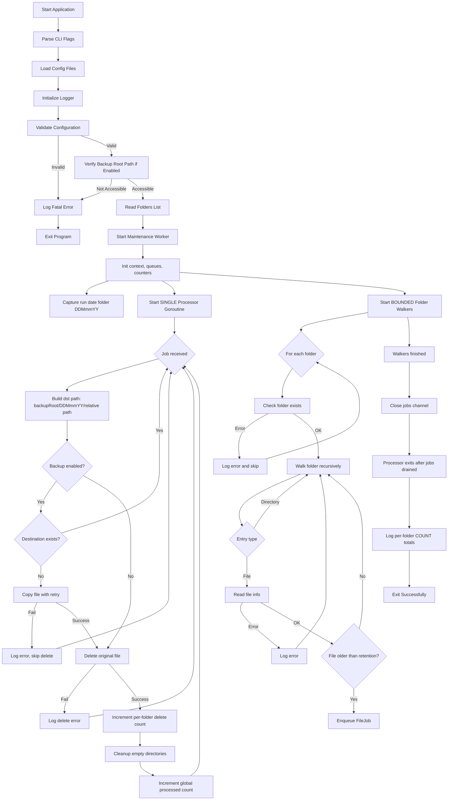

```mermaid 
flowchart TD
    A[Start Application] --> B[Parse CLI Flags]
    B --> C[Load Config Files]
    C --> D[Initialize Logger]
    D --> E[Validate Configuration]

    E -->|Invalid| F[Log Fatal Error]
    F --> G[Exit Program]

    E -->|Valid| H[Verify Backup Root Path if Enabled]
    H -->|Not Accessible| F
    H -->|Accessible| I[Read Folders List]

    I --> J[Start Maintenance Worker]

    J --> K[Init context, queues, counters]
    K --> K2[Capture run date folder DDMmmYY]
    K --> L[Start SINGLE Processor Goroutine]
    K --> M[Start BOUNDED Folder Walkers]

    M --> N{For each folder}
    N --> O[Check folder exists]
    O -->|Error| P[Log error and skip] --> N
    O -->|OK| Q[Walk folder recursively]

    Q --> R{Entry type}
    R -->|Directory| Q
    R -->|File| S[Read file info]

    S -->|Error| T[Log error] --> Q
    S -->|OK| U{File older than retention?}

    U -->|No| Q
    U -->|Yes| V[Enqueue FileJob]

    L --> W{Job received}
    W --> X[Build dst path: backupRoot/DDMmmYY/relative path]
    X --> Y{Backup enabled?}

    Y -->|Yes| Y2{Destination exists?}
    Y2 -->|Yes| W
    Y2 -->|No| Z[Copy file with retry]

    Z -->|Fail| AA[Log error, skip delete] --> W
    Z -->|Success| AB[Delete original file]

    Y -->|No| AB

    AB -->|Fail| AC[Log delete error] --> W
    AB -->|Success| AD[Increment per-folder delete count]
    AD --> AE[Cleanup empty directories]
    AE --> AF[Increment global processed count]
    AF --> W

    M --> AG[Walkers finished]
    AG --> AH[Close jobs channel]
    AH --> AI[Processor exits after jobs drained]

    AI --> AJ[Log per-folder COUNT totals]
    AJ --> AK[Exit Successfully]


```