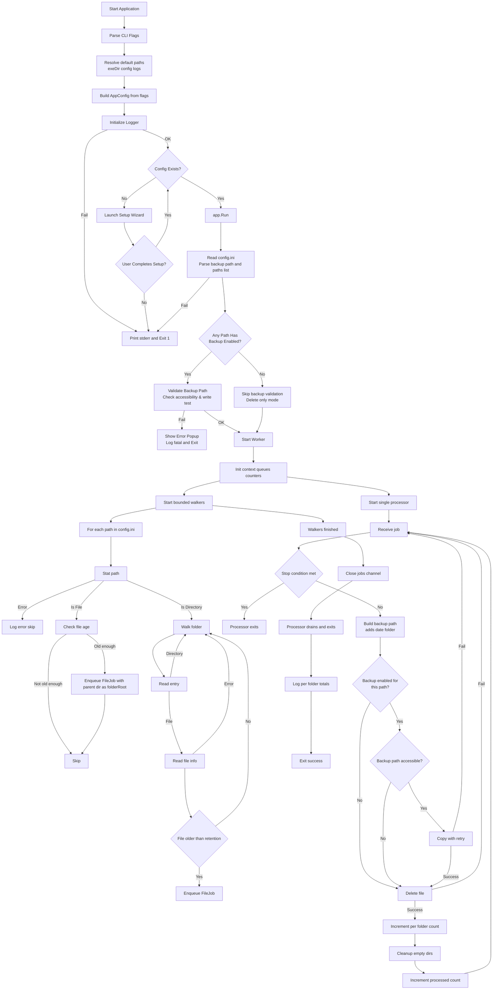

```mermaid 
flowchart TD
  A[Start Application]
  B[Parse CLI Flags]
  C[Resolve default paths<br/>exeDir config logs]
  D[Build AppConfig from flags]
  E[Initialize Logger]
  F[Print stderr and Exit 1]

  A --> B
  B --> C
  C --> D
  D --> E
  E -->|Fail| F

  E -->|OK| G{Config Exists?}
  
  G -->|No| H[Launch Setup Wizard]
  H --> I{User Completes Setup?}
  I -->|No| F
  I -->|Yes| G
  
  G -->|Yes| J[app.Run]

  J --> K[Read config.ini<br/>Parse backup path and paths list]
  K -->|Fail| F

  K --> L{Any Path Has<br/>Backup Enabled?}
  L -->|No| M[Skip backup validation<br/>Delete only mode]
  L -->|Yes| N[Validate Backup Path<br/>Check accessibility & write test]
  
  N -->|Fail| O[Show Error Popup<br/>Log fatal and Exit]
  N -->|OK| P[Start Worker]

  M --> P

  P --> Q[Init context queues counters]
  Q --> R[Start single processor]
  Q --> S[Start bounded walkers]

  S --> T[For each path in config.ini]
  T --> U[Stat path]
  U -->|Error| V[Log error skip]
  U -->|Is File| W[Check file age]
  U -->|Is Directory| X[Walk folder]

  W -->|Not old enough| Y[Skip]
  W -->|Old enough| Z[Enqueue FileJob with parent dir as folderRoot]
  Z --> Y

  X --> AA[Read entry]
  AA -->|Directory| X
  AA -->|File| AB[Read file info]
  AB -->|Error| X
  AB --> AC{File older than retention}
  AC -->|No| X
  AC -->|Yes| AD[Enqueue FileJob]

  R --> AE[Receive job]
  AE --> AF{Stop condition met}
  AF -->|Yes| AG[Processor exits]
  AF -->|No| AH[Build backup path<br/>adds date folder]

  AH --> AI{Backup enabled for<br/>this path?}
  AI -->|No| AJ[Delete file]
  AI -->|Yes| AK{Backup path accessible?}
  
  AK -->|No| AJ
  AK -->|Yes| AL[Copy with retry]

  AL -->|Fail| AE
  AL -->|Success| AJ

  AJ -->|Fail| AE
  AJ -->|Success| AM[Increment per folder count]
  AM --> AN[Cleanup empty dirs]
  AN --> AO[Increment processed count]
  AO --> AE

  S --> AP[Walkers finished]
  AP --> AQ[Close jobs channel]
  AQ --> AR[Processor drains and exits]
  AR --> AS[Log per folder totals]
  AS --> AT[Exit success]

```