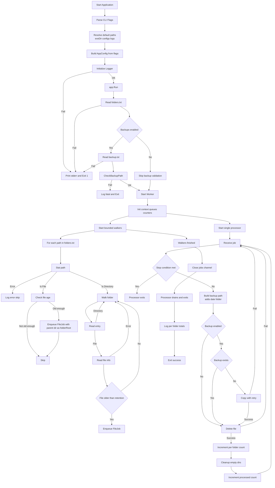

```mermaid 
flowchart TD
  A[Start Application]
  B[Parse CLI Flags]
  C[Resolve default paths<br/>exeDir configs logs]
  D[Build AppConfig from flags]
  E[Initialize Logger]
  F[Print stderr and Exit 1]

  A --> B
  B --> C
  C --> D
  D --> E
  E -->|Fail| F

  E -->|OK| G[app.Run]

  G --> H[Read folders.txt]
  H -->|Fail| F

  H --> I{Backups enabled}
  I -->|No| J[Skip backup validation]
  I -->|Yes| K[Read backup.txt]
  K -->|Fail| F
  K --> L[CheckBackupPath]
  L -->|Fail| M[Log fatal and Exit]
  L -->|OK| N[Start Worker]

  J --> N

  N --> O[Init context queues counters]
  O --> P[Start single processor]
  O --> Q[Start bounded walkers]

  Q --> R[For each path in folders.txt]
  R --> S[Stat path]
  S -->|Error| T[Log error skip]
  S -->|Is File| U[Check file age]
  S -->|Is Directory| V[Walk folder]

  U -->|Not old enough| W[Skip]
  U -->|Old enough| X[Enqueue FileJob with parent dir as folderRoot]
  X --> W

  V --> Y[Read entry]
  Y -->|Directory| V
  Y -->|File| Z[Read file info]
  Z -->|Error| V
  Z --> AA{File older than retention}
  AA -->|No| V
  AA -->|Yes| AB[Enqueue FileJob]

  P --> AC[Receive job]
  AC --> AD{Stop condition met}
  AD -->|Yes| AE[Processor exits]
  AD -->|No| AF[Build backup path<br/>adds date folder]

  AF --> AG{Backup enabled}
  AG -->|No| AH[Delete file]
  AG -->|Yes| AI{Backup exists}
  AI -->|Yes| AH
  AI -->|No| AJ[Copy with retry]

  AJ -->|Fail| AC
  AJ -->|Success| AH

  AH -->|Fail| AC
  AH -->|Success| AK[Increment per folder count]
  AK --> AL[Cleanup empty dirs]
  AL --> AM[Increment processed count]
  AM --> AC

  Q --> AN[Walkers finished]
  AN --> AO[Close jobs channel]
  AO --> AP[Processor drains and exits]
  AP --> AQ[Log per folder totals]
  AQ --> AR[Exit success]

```