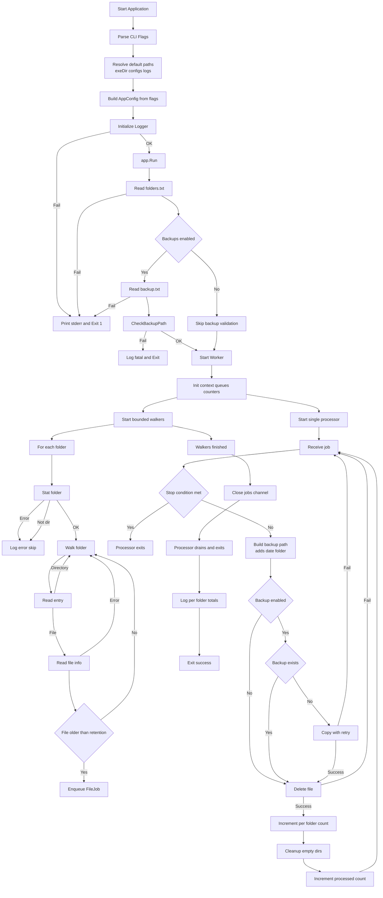

```mermaid 
flowchart TD
  A[Start Application]
  B[Parse CLI Flags]
  C[Resolve default paths<br/>exeDir configs logs]
  D[Build AppConfig from flags]
  E[Initialize Logger]
  F[Print stderr and Exit 1]

  A --> B
  B --> C
  C --> D
  D --> E
  E -->|Fail| F

  E -->|OK| G[app.Run]

  G --> H[Read folders.txt]
  H -->|Fail| F

  H --> I{Backups enabled}
  I -->|No| J[Skip backup validation]
  I -->|Yes| K[Read backup.txt]
  K -->|Fail| F
  K --> L[CheckBackupPath]
  L -->|Fail| M[Log fatal and Exit]
  L -->|OK| N[Start Worker]

  J --> N

  N --> O[Init context queues counters]
  O --> P[Start single processor]
  O --> Q[Start bounded walkers]

  Q --> R[For each folder]
  R --> S[Stat folder]
  S -->|Error| T[Log error skip]
  S -->|Not dir| T
  S -->|OK| U[Walk folder]

  U --> V[Read entry]
  V -->|Directory| U
  V -->|File| W[Read file info]
  W -->|Error| U
  W --> X{File older than retention}
  X -->|No| U
  X -->|Yes| Y[Enqueue FileJob]

  P --> Z[Receive job]
  Z --> AA{Stop condition met}
  AA -->|Yes| AB[Processor exits]
  AA -->|No| AC[Build backup path<br/>adds date folder]

  AC --> AD{Backup enabled}
  AD -->|No| AE[Delete file]
  AD -->|Yes| AF{Backup exists}
  AF -->|Yes| AE
  AF -->|No| AG[Copy with retry]

  AG -->|Fail| Z
  AG -->|Success| AE

  AE -->|Fail| Z
  AE -->|Success| AH[Increment per folder count]
  AH --> AI[Cleanup empty dirs]
  AI --> AJ[Increment processed count]
  AJ --> Z

  Q --> AK[Walkers finished]
  AK --> AL[Close jobs channel]
  AL --> AM[Processor drains and exits]
  AM --> AN[Log per folder totals]
  AN --> AO[Exit success]

```