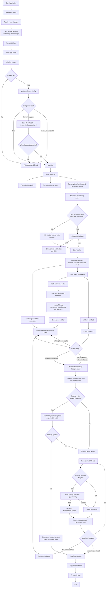

```mermaid
flowchart TD
  A[Start Application]
  B[platform.Current]
  C[Resolve exe directory]
  D[Set portable defaults<br/>exe/config and exe/logs]
  E[Parse CLI flags]
  F[Build AppConfig]
  G[Initialize Logger]
  H{Logger OK?}
  I[Print stderr and Exit 1]

  A --> B --> C --> D --> E --> F --> G --> H
  H -->|No| I
  H -->|Yes| J[platform.EnsureConfig]

  J --> K{config.ini exists?}
  K -->|Yes| N[app.Run]
  K -->|No on Windows| L[Launch embedded PowerShell setup wizard]
  L --> M{Wizard created config.ini?}
  M -->|No| I
  M -->|Yes| N
  K -->|No on Linux/macOS| I

  N --> O[Read config.ini]
  O --> P[Parse backup path]
  O --> Q[Parse configured paths]
  O --> R[Parse optional settings and advanced values]
  R --> S[Apply non-zero config values]

  S --> T{Any configured path<br/>has backup enabled?}
  T -->|No| U[Skip startup backup-path validation]
  T -->|Yes| V[CheckBackupPath]
  V -->|Fail| W[Show critical notification and Exit 1]
  V -->|OK| X[Start Worker]
  U --> X

  X --> Y[Initialize counters,<br/>context, and unbuffered job input]
  Y --> Z[Start single batcher / processor]
  Y --> AA[Start bounded walkers]

  AA --> AB[Walk configured paths]
  AB --> AC[Find files older than retention]
  AC --> AD[Create FileJob<br/>with source path, backup flag, and size]
  AD --> AE[Send job to batcher]

  Z --> AF[Collect jobs into in-memory batch]
  AE --> AF
  AF --> AG{Batch ready?}
  AG -->|Reached queue-size| AH[Pause intake through backpressure]
  AG -->|Job input closed<br/>with partial batch| AH
  AG -->|Waiting for more jobs| AF

  AH --> AI[Total backup-enabled bytes<br/>for current batch]
  AI --> AJ{Backup bytes<br/>greater than zero?}
  AJ -->|Yes| AK[AvailableBytes backupRoot<br/>once for this batch]
  AK --> AL{Enough space?}
  AL -->|No| AM[Store error, cancel context,<br/>leave sources in place]
  AL -->|Yes| AN[Process batch serially]
  AJ -->|No| AN

  AN --> AO[Process next FileJob]
  AO --> AP{Backup enabled<br/>for job?}
  AP -->|Yes| AQ[Build backup path and copy with retry]
  AQ -->|Fail| AR[Log error<br/>do not delete source]
  AQ -->|Success| AS[Delete source file]
  AP -->|No| AS
  AS --> AT[Increment counts and processed jobs]
  AR --> AT
  AT --> AU{More jobs in batch?}
  AU -->|Yes| AO
  AU -->|No and input open| AV[Accept next batch]
  AV --> AF
  AU -->|No and input closed| AZ[Wait for processor]

  AA --> AW[Walkers finished]
  AW --> AX[Close job input]
  AX --> AG
  AM --> AZ
  AZ --> BA[Log per-path totals]
  BA --> BB[Prune old logs]
  BB --> BC[Exit]
```
