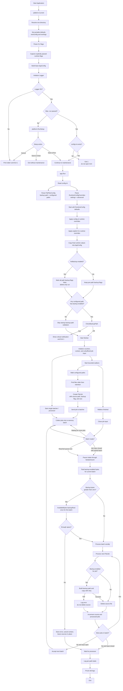

```mermaid
flowchart TD
  A[Start Application]
  B[platform.Current]
  C[Resolve exe directory]
  D[Set portable defaults<br/>exe/config and exe/logs]
  E[Parse CLI flags]
  F[Capture explicitly passed runtime flags]
  G[Build base AppConfig]
  H[Initialize Logger]
  I{Logger OK?}
  J[Print stderr and Exit 1]

  A --> B --> C --> D --> E --> F --> G --> H --> I
  I -->|No| J
  I -->|Yes| K{Was -run passed?}

  K -->|No| L[platform.RunSetup]
  L --> M{Setup action}
  M -->|Cancel| J
  M -->|Save & Close| N[Exit without maintenance]
  M -->|Save & Run| Q[Continue to maintenance]

  K -->|Yes| O{config.ini exists?}
  O -->|No| P[Exit 1<br/>do not open GUI]
  O -->|Yes| Q

  Q --> R[app.Run]
  R --> S[Read config.ini]
  S --> T[Parse FilePlanConfig<br/>backup path + configured paths]
  S --> U[Parse RuntimeConfigOverrides<br/>settings + advanced]
  U --> V[Start with RuntimeConfig defaults]
  V --> W[Apply config.ini runtime overrides]
  W --> X[Apply explicit CLI runtime overrides]
  X --> Y[Copy final runtime values into AppConfig]

  Y --> Z{NoBackup enabled?}
  Z -->|Yes| AA[Mark all path backup flags false<br/>delete-only run]
  Z -->|No| AB[Keep per-path backup flags]
  AA --> AC{Any configured path<br/>has backup enabled?}
  AB --> AC

  AC -->|No| AD[Skip startup backup-path validation]
  AC -->|Yes| AE[CheckBackupPath]
  AE -->|Fail| AF[Show critical notification and Exit 1]
  AE -->|OK| AG[Start Worker]
  AD --> AG

  AG --> AH[Initialize counters,<br/>context, and unbuffered job input]
  AH --> AI[Start single batcher / processor]
  AH --> AJ[Start bounded walkers]

  AJ --> AK[Walk configured paths]
  AK --> AL[Find files older than retention]
  AL --> AM[Create FileJob<br/>with source path, backup flag, and size]
  AM --> AN[Send job to batcher]

  AI --> AO[Collect jobs into in-memory batch]
  AN --> AO
  AO --> AP{Batch ready?}
  AP -->|Reached queue-size| AQ[Pause intake through backpressure]
  AP -->|Job input closed<br/>with partial batch| AQ
  AP -->|Waiting for more jobs| AO

  AQ --> AR[Total backup-enabled bytes<br/>for current batch]
  AR --> AS{Backup bytes<br/>greater than zero?}
  AS -->|Yes| AT[AvailableBytes backupRoot<br/>once for this batch]
  AT --> AU{Enough space?}
  AU -->|No| AV[Store error, cancel context,<br/>leave sources in place]
  AU -->|Yes| AW[Process batch serially]
  AS -->|No| AW

  AW --> AX[Process next FileJob]
  AX --> AY{Backup enabled<br/>for job?}
  AY -->|Yes| AZ[Build backup path and copy with retry]
  AZ -->|Fail| BA[Log error<br/>do not delete source]
  AZ -->|Success| BB[Delete source file]
  AY -->|No| BB
  BB --> BC[Increment counts and processed jobs]
  BA --> BC
  BC --> BD{More jobs in batch?}
  BD -->|Yes| AX
  BD -->|No and input open| BE[Accept next batch]
  BE --> AO
  BD -->|No and input closed| BI[Wait for processor]

  AJ --> BF[Walkers finished]
  BF --> BG[Close job input]
  BG --> AP
  AV --> BI
  BI --> BJ[Log per-path totals]
  BJ --> BK[Prune old logs]
  BK --> BL[Exit]
```
