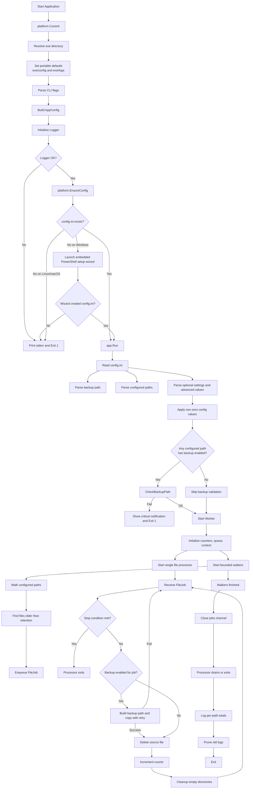

```mermaid
flowchart TD
  A[Start Application]
  B[platform.Current]
  C[Resolve exe directory]
  D[Set portable defaults<br/>exe/config and exe/logs]
  E[Parse CLI flags]
  F[Build AppConfig]
  G[Initialize Logger]
  H{Logger OK?}
  I[Print stderr and Exit 1]

  A --> B --> C --> D --> E --> F --> G --> H
  H -->|No| I
  H -->|Yes| J[platform.EnsureConfig]

  J --> K{config.ini exists?}
  K -->|Yes| N[app.Run]
  K -->|No on Windows| L[Launch embedded PowerShell setup wizard]
  L --> M{Wizard created config.ini?}
  M -->|No| I
  M -->|Yes| N
  K -->|No on Linux/macOS| I

  N --> O[Read config.ini]
  O --> P[Parse backup path]
  O --> Q[Parse configured paths]
  O --> R[Parse optional settings and advanced values]
  R --> S[Apply non-zero config values]

  S --> T{Any configured path<br/>has backup enabled?}
  T -->|No| U[Skip backup validation]
  T -->|Yes| V[CheckBackupPath]
  V -->|Fail| W[Show critical notification and Exit 1]
  V -->|OK| X[Start Worker]
  U --> X

  X --> Y[Initialize counters, queue, context]
  Y --> Z[Start single file processor]
  Y --> AA[Start bounded walkers]

  AA --> AB[Walk configured paths]
  AB --> AC[Find files older than retention]
  AC --> AD[Enqueue FileJob]

  Z --> AE[Receive FileJob]
  AE --> AF{Stop condition met?}
  AF -->|Yes| AG[Processor exits]
  AF -->|No| AH{Backup enabled for job?}
  AH -->|Yes| AI[Build backup path and copy with retry]
  AI -->|Fail| AE
  AI -->|Success| AJ[Delete source file]
  AH -->|No| AJ
  AJ --> AK[Increment counts]
  AK --> AL[Cleanup empty directories]
  AL --> AE

  AA --> AM[Walkers finished]
  AM --> AN[Close jobs channel]
  AN --> AO[Processor drains or exits]
  AO --> AP[Log per-path totals]
  AP --> AQ[Prune old logs]
  AQ --> AR[Exit]
```
