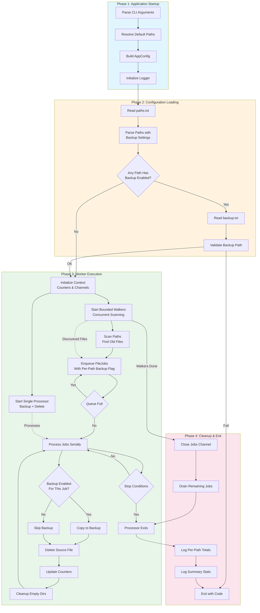

```mermaid
flowchart TD
    subgraph Startup[Phase 1: Application Startup]
        A[Parse CLI Arguments]
        B[Resolve Default Paths]
        C[Build AppConfig]
        D[Initialize Logger]
    end

    subgraph Configuration[Phase 2: Configuration Loading]
        E[Read paths.txt]
        F[Parse Paths with<br/>Backup Settings]
        G{Any Path Has<br/>Backup Enabled?}
        H[Read backup.txt]
        I[Validate Backup Path]
    end

    subgraph Worker[Phase 3: Worker Execution]
        J[Initialize Context<br/>Counters & Channels]
        K[Start Single Processor<br/>Backup + Delete]
        L[Start Bounded Walkers<br/>Concurrent Scanning]
        
        L --> M[Scan Paths<br/>Find Old Files]
        M --> N[Enqueue FileJobs<br/>With Per-Path Backup Flag]
        N --> O{Queue Full}
        O -->|Yes| N
        O -->|No| P[Process Jobs Serially]
        
        P --> Q{Backup Enabled<br/>For This Job?}
        Q -->|Yes| R[Copy to Backup]
        Q -->|No| S[Skip Backup]
        
        R --> T[Delete Source File]
        S --> T
        
        T --> U[Update Counters]
        U --> V[Cleanup Empty Dirs]
        V --> P
        
        P --> W{Stop Conditions}
        W -->|No| P
        W -->|Yes| X[Processor Exits]
    end

    subgraph Cleanup[Phase 4: Cleanup & Exit]
        Y[Close Jobs Channel]
        Z[Drain Remaining Jobs]
        AA[Log Per-Path Totals]
        BB[Log Summary Stats]
        CC[Exit with Code]
    end

    %% Startup Flow
    A --> B
    B --> C
    C --> D
    
    %% Configuration Flow
    D --> E
    E --> F
    F --> G
    G -->|No| J
    G -->|Yes| H
    H --> I
    I -->|Fail| CC
    I -->|OK| J
    
    %% Worker Flow
    J --> K
    J --> L
    
    L -.-> |Discovered Files| N
    K -.-> |Processes| P
    
    %% Shutdown Flow
    L --> |Walkers Done| Y
    Y --> Z
    Z --> X
    X --> AA
    AA --> BB
    BB --> CC

    %% Styling
    style Startup fill:#e1f5fe
    style Configuration fill:#fff3e0
    style Worker fill:#e8f5e9
    style Cleanup fill:#fce4ec
```