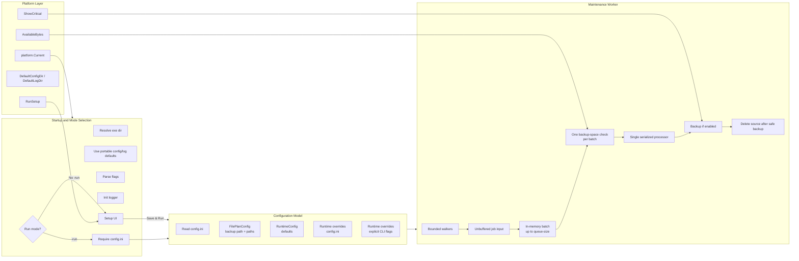

```mermaid
flowchart LR
    subgraph Platform[Platform Layer]
        P1[platform.Current]
        P2[RunSetup]
        P3[ShowCritical]
        P4[DefaultConfigDir / DefaultLogDir]
        P5[AvailableBytes]
    end

    subgraph Startup[Startup and Mode Selection]
        S1[Resolve exe dir]
        S2[Use portable config/log defaults]
        S3[Parse flags]
        S4[Init logger]
        S5{Run mode?}
        S6[Setup UI]
        S7[Require config.ini]
    end

    subgraph Config[Configuration Model]
        C1[Read config.ini]
        C2[FilePlanConfig<br/>backup path + paths]
        C3[RuntimeConfig<br/>defaults]
        C4[Runtime overrides<br/>config.ini]
        C5[Runtime overrides<br/>explicit CLI flags]
    end

    subgraph Worker[Maintenance Worker]
        W1[Bounded walkers]
        W2[Unbuffered job input]
        W3[In-memory batch<br/>up to queue-size]
        W4[One backup-space check<br/>per batch]
        W5[Single serialized processor]
        W6[Backup if enabled]
        W7[Delete source after safe backup]
    end

    P1 --> Startup
    S5 -->|No -run| S6
    S5 -->|-run| S7
    P2 --> S6
    S6 -->|Save & Run| Config
    S7 --> Config
    Config --> Worker
    P5 --> W4
    P3 --> W6
    W1 --> W2 --> W3 --> W4 --> W5 --> W6 --> W7
```
